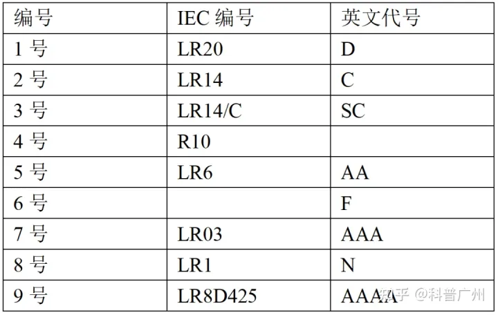

# [Battery Sizes](https://en.wikipedia.org/wiki/List_of_battery_sizes)
[^zhihu]

[【完结撒花】常见大品牌5号电池性能&性价比小横评 - 原创分享(新) - Chiphell - 分享与交流用户体验](https://www.chiphell.com/forum.php?mod=viewthread&tid=2382967&page=1&authorid=158835)

[^zhihu]: [为什么电池只有3号，5号，7号？1，2，4，6，8号呢？ - 知乎](https://www.zhihu.com/question/37717011)